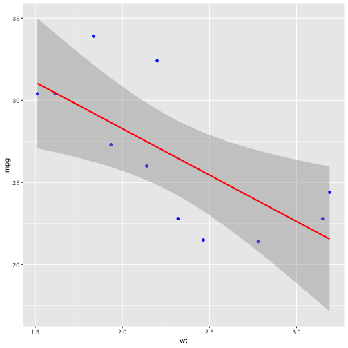

Simple prediction of car mpg using car weight
========================================================
author: Honorio Valdes
date: 08/06/20
autosize: true

Background
========================================================

- The proposed application predicts the mpg of a car given the weight and cylinder number
- The model is built using data from the mtcars data set
- The user enters the number of cylinders using a radio button and the weight using a slider with range between 0 and 10k tons
- The app provides the user a plot showing data for the given number of cylinders with a regression line plot and the model parameters (slope and y-intercept)

Model code (4 cylinder example)
========================================================

- The following code is used to build the model


```r
data(mtcars)
numcyls <- 4
plotdata <- mtcars[mtcars$cyl==numcyls, ]
mod <- lm(mpg ~ wt,data=plotdata)
```

- The model parameters are provided below


```r
mod$coefficients
```

```
(Intercept)          wt 
  39.571196   -5.647025 
```

Prediction example code
========================================================

- The following code is used to predict the weight (using 5k tons as an example)


```r
predict(mod,newdata=data.frame(wt=5))
```

```
       1 
11.33607 
```


Plot example (4 cylinders)
========================================================


